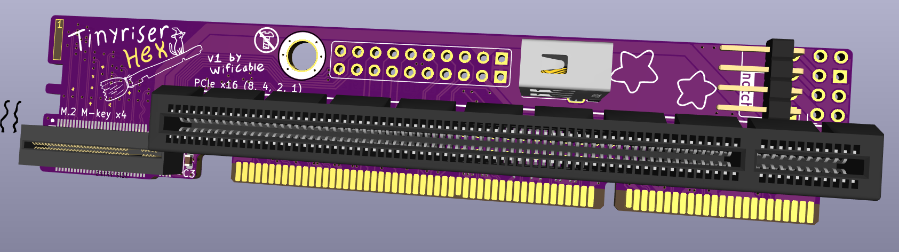
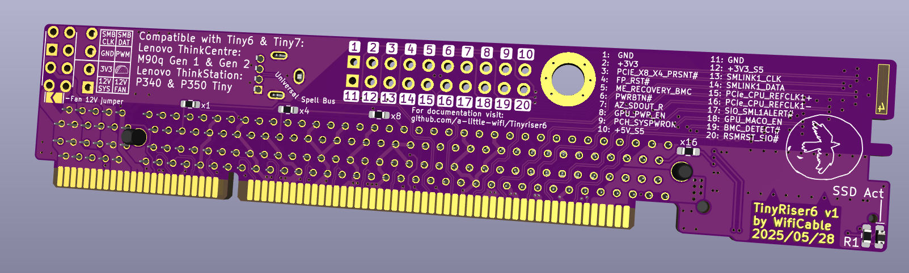
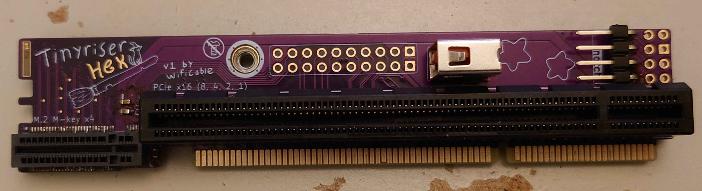
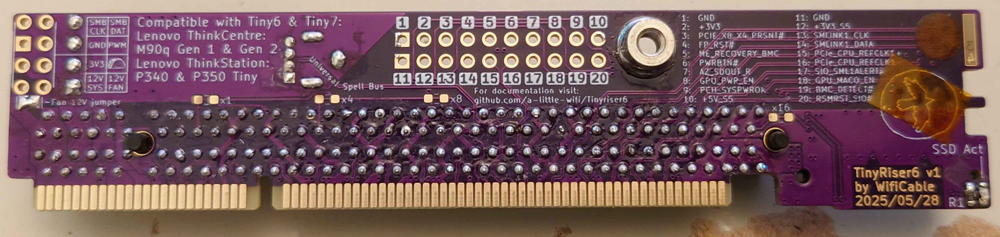
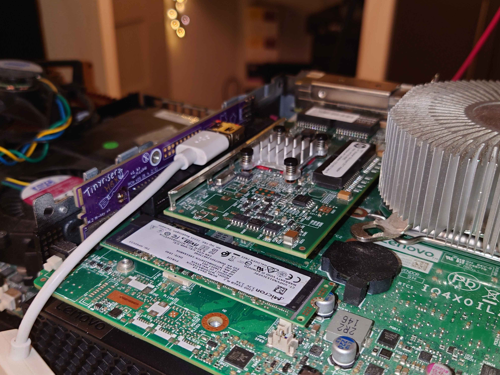
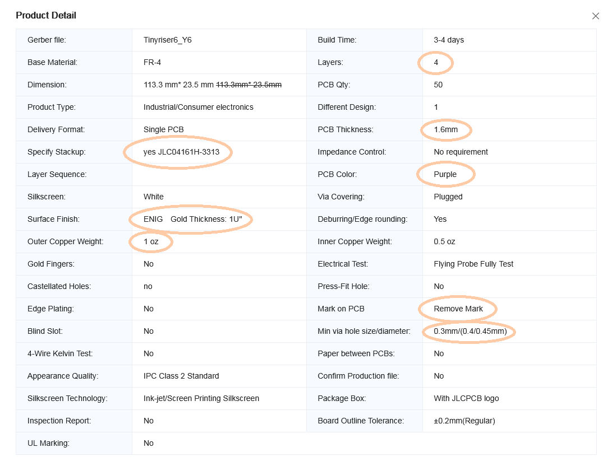

# Tinyriser Hex (Tinyriser6)
Tinyriser for the Tiny6 and Tiny7 generation of Lenovo Tiny PCs
Same idea as [the original Tinyriser](https://github.com/a-little-wifi/Tinyriser), but for the next gen.  
Compatible with M90q gen 1 & 2, P340 and P350 Tiny (M70q and M80q don't have the riser slot populated)

## Features:

- PCIe x16 slot (8 lanes from CPU)
- M.2 M-key NVMe slot (4 lanes from PCH)
- USB 2.0 port
- Fan header
- Other random riser slot IO breakout (for science)
- Plug and play, no mainboard modification necessary

> front and back in 3D render  

> front and back in real life

This riser gives you access to the PCIe x8 link from the CPU and the PCIe x4 link from the PCH at the same time, in the form of a PCIe x16 (physical) slot and an M.2 M-key slot.  
Also has a USB 2.0 port because the riser slot has it so why not.  
It does not require any modification to the motherboard of the host machine, just plug and play.  

Using this riser, you can install a low profile PCIe card just as you can with the stock risers, and add an extra M.2 NVMe SSD in addition to the onboard ones. The SSD is tucked away near the front of the machine, plugged into a right angle M-key M.2 slot that holds the SSD firmly in place.  
M.2 2280 length SSDs might have some trouble fitting, especially in combination with longer PCIe cards as they run into the fan and speaker connector on the motherboard. I leave it up to the individual to judge what will be a good fit.  

I've successfully tested this design in P340 (Tiny6) and P350 (Tiny7) machines. Both PCIe links with all lanes as well as the USB port are fully functional in both of them.  

> riser installed in a P340 with PCIe card, SSD and USB cable attached

### Fan header:
The fan header has the same 3 modes as on the original Tinyriser:
- 12V no PWM
- 12V with PWM
- Voltage controlled speed

The last 2 modes require some kind of fan controller module plugged into the provided header. This has not been designed yet, but the possibility exists.

**Update: v1.1 now has a '5V no PWM' mode available as well, adding an extra jumper from the 5V rail instead of the 12V rail. This 5V rail is always on though, so the fan would be powered even when the system is turned off.**  
**Also be careful when soldering the 5V jumper, it's really close to a 12V pin from the PCIe slot.**

## Thank you

I want to say thank you to everyone for the kind words about my first riser design, I never expected it to reach so far and get so much interest. I originally made it just because I wanted to know if it would work and because I needed a riser for my M720q anyway (would you believe I don't own or have even ever seen a stock Lenovo Tiny5 riser?).  
The experience has had its ups and downs, it turned out I was nowhere near prepared to be handling sales, there's been a few people trying to take credit for my work, and life has been throwing one thing after the other at me, there've been many times I felt bad about it (sorry for the occasional blunt or delayed replies), but in the end I'm still glad I could put it out there and that people have been able to enjoy it. I've even had people reach out suggesting different riser versions and requesting assistance with making modified designs, that's what I love to see. I hope the same will go for this one.

So really, thank you to everyone who has expressed their appreciation for my work, and maybe even bought one from me directly during the short time that was possible. Your support really fills my little wifi heart with motivation to continue making my silly pieces of PCB art in my own way. I hope to keep delving into the depths of modern PC hardware architecture and to deliver more high quality designs with some soul of their own in the future.

This design is the result of everything I've learned from my experience with the original Tinyariser and more. It includes an improved edge connector design that better follows industry standards, a short-circuit discouragement pictogram, several hidden cats, silly puns and more magic.

### Made with ❤ and ✨ by Wifi. I poured my heart, soul and passion into this, I hope you love it too!

## Parts list: 
| part                | model                     | link                                                                                             |
|---------------------|---------------------------|--------------------------------------------------------------------------------------------------|
| PCIe slot           | UMAX 3183-10203P1T        | https://www.lcsc.com/product-detail/Card-Edge-Connectors_UMAX-3183-10203P1T_C404116.html         |
| Vertical M-key slot | Lotes APCI0110-P001A      | (available on aliexpress)                                                                        |
| Alt M-key slot      | HOAUC HYCW19M-05NGFF-530B | https://jlcpcb.com/partdetail/HOAUC-HYCW19M_05NGFF530B/C41430861 (out of stock, but should work with JLC assmebly?) |
| Screwpost           | YIYUAN SMTSOM340BTR       | https://www.lcsc.com/product-detail/Other-nuts_YIYUAN-SMTSOM340BTR_C5301786.html                 |
| USB port            | Jing 906-862A1118D10200   | https://www.lcsc.com/product-detail/C2763236.html (Warning: EasyEDA footprint pinout is reversed)|

## JLC PCB ordering details:

Please use the files from the v1 release, the main repo might be in the middle of version changes

You're welcome to place your own group orders if you know enough people who are interested in getting one of these risers, however please leave actual selling of this riser design to me and people I've specifically made agreements with.

### Order it in purple Ò̶̖͗̅Ŕ̵͈ ̴̠̬̝̚E̷̖̘̐́̿L̴̢͉̠̕͝S̵͖̺̰̋̀Ē̶̫̾ͅ

> Screenshot of the JLC PCB order settings used for Tinyriser6

# Attribution
If you distribute this design or use this design to create a derivative design, you must keep attribution to this original design, in addition to following the terms in the license
